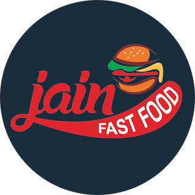

&nbsp;&nbsp;&nbsp;&nbsp;&nbsp;

<h1 align="center">
  Hitarth Bhatt
</h1>

&nbsp;

<h5 align="center">
  IOS Developer Portfolio
</h5>

&nbsp;&nbsp;&nbsp;
&nbsp;&nbsp;&nbsp;

&nbsp;

<h2 align="center">
  Work Experience
</h2>

&nbsp;

<h3 align="center">
  Jain Fast Food
</h3>

Sakura is an iOS word-guessing game, which I recently built as a take-home project. The specs were to build a basic 'hangman' game, and to then extend it as I saw fit. I decided to run with it and build something a bit more positive, creative, and colorful. In my app, the Sakura tree loses blooms each time you make an incorrect guess. If you guess the word correctly, the tree bursts back into bloom with a lovely animation.

I'm extremely pleased with how the project came out. I'm particularly proud of the app's animation, UI design, and easily-extended architecture. Sakura was built with Xcode and written entirely in Swift 5; it utilizes Auto Layout for UI design, and makes extensive use of both UIView animations and CAEmitterLayers.  

&nbsp;&nbsp;&nbsp;&nbsp;&nbsp;&nbsp;&nbsp;&nbsp;&nbsp;&nbsp;&nbsp;&nbsp;&nbsp;&nbsp;&nbsp;

