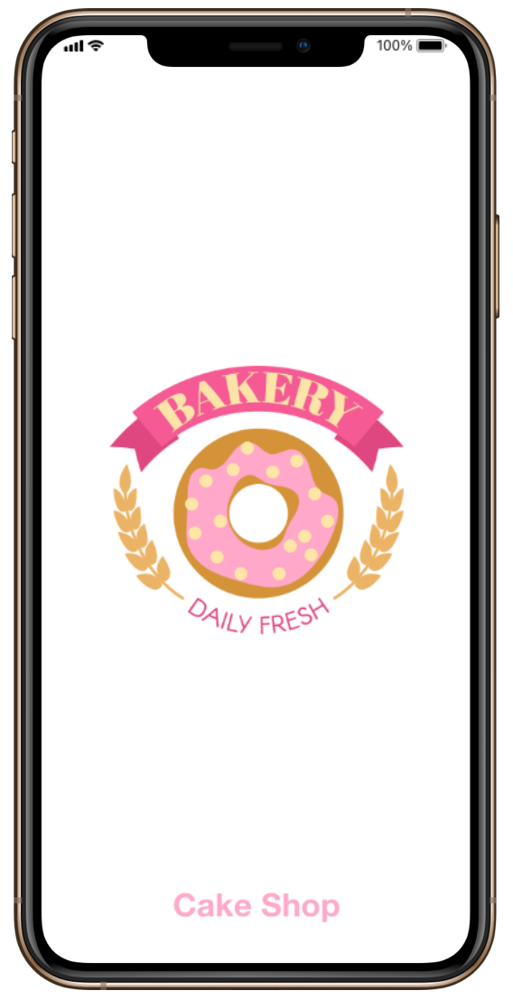
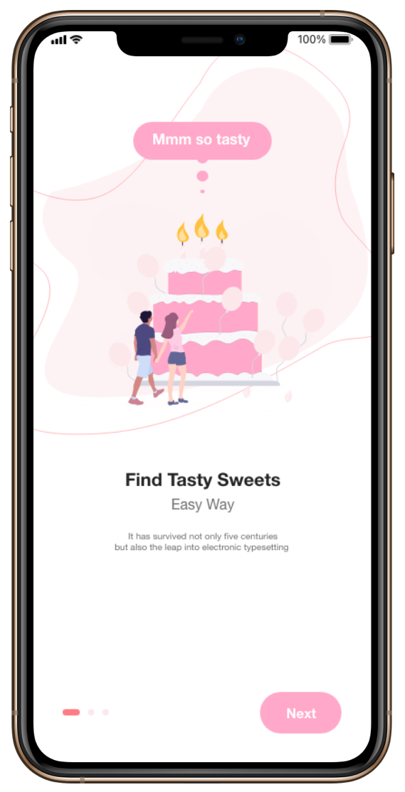
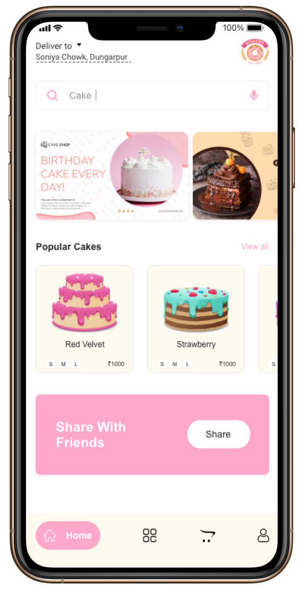
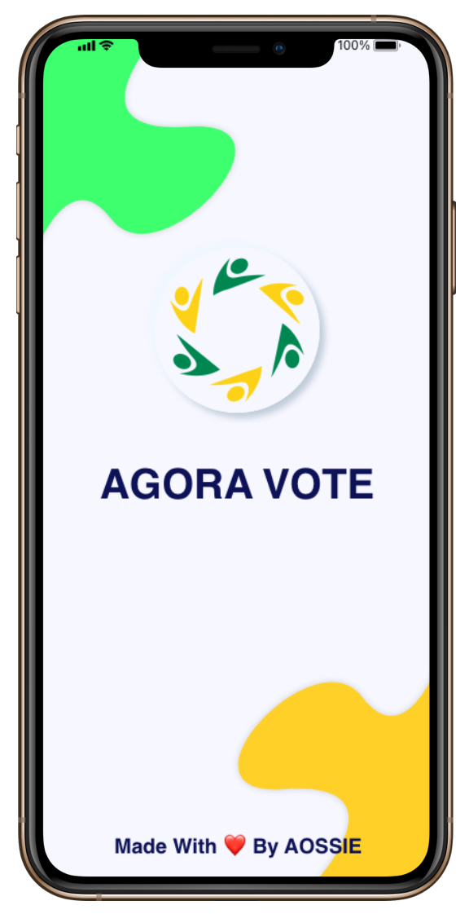
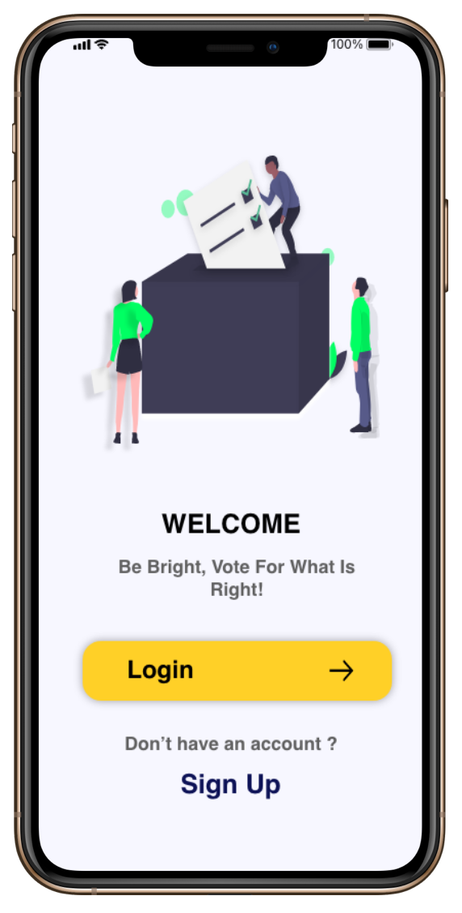
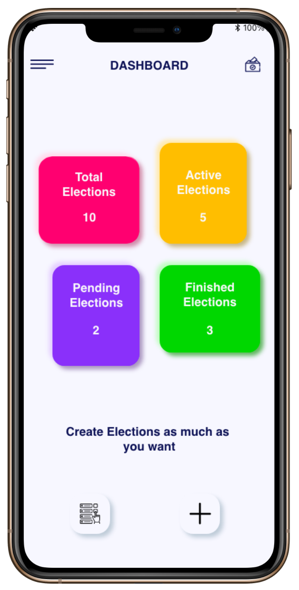
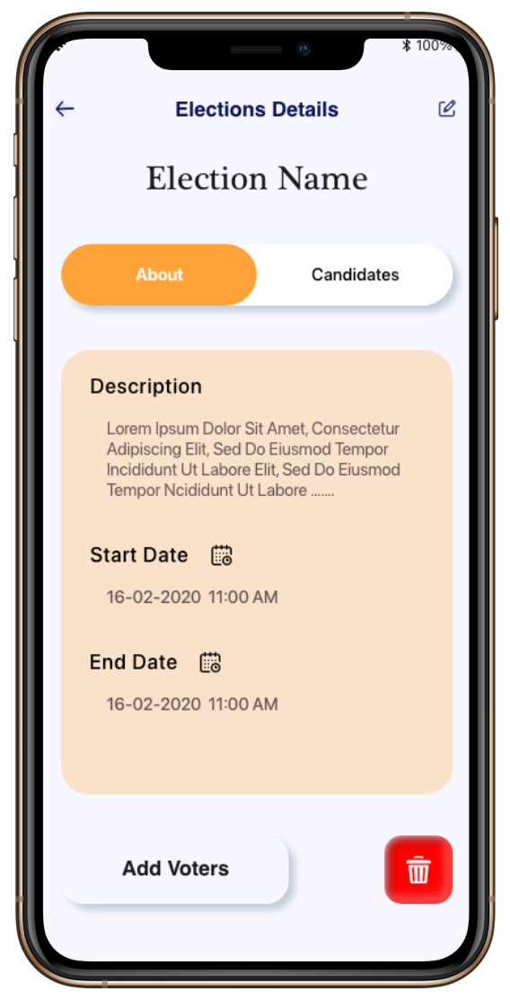

&nbsp;

<h1 align="center">
  Hitarth Bhatt
</h1>

<h5 align="center">
  IOS Developer Portfolio
</h5>

&nbsp;&nbsp;&nbsp;
&nbsp;&nbsp;&nbsp;

<h2 align="center">
  Work Experience
</h2>

&nbsp;

<h2 align="center">
  Jain Fast Food
</h2>

Jain Fast Food is the fast-food application that I build for my first client and distribute to the App Store. In this application, the users can see all the food which are available in the client cafe.
Users have several features like Add to cart, Select quantity, Favorites, Pay on delivery, Takeaway and Order Status, etc. these are the main features that increase User Experience.

I'm extremely pleased with how the project came out. I'm particularly proud of the app's animation, UI design, and easily-extended architecture. Jain Fast Food was built with Xcode and written entirely in Swift 5

<h3>
  <b>Framework Used</b>
  </h3>

SwiftUI, Firebase, CoreLocation, Push Notification, JSON, SwiftyJSON, UIKit, Combine, SDWebImage

&nbsp;

&nbsp;&nbsp;&nbsp;&nbsp;&nbsp;&nbsp;&nbsp;&nbsp;&nbsp;&nbsp;&nbsp;&nbsp;&nbsp;&nbsp;&nbsp;

&nbsp;

&nbsp;

<h2 align="center">
  Cake Shop
</h2>

Jain Fast Food is the fast-food application that I build for my first client and distribute to the App Store. In this application, the users can see all the food which are available in the client cafe.
Users have several features like Add to cart, Select quantity, Favorites, Pay on delivery, Takeaway and Order Status, etc. these are the main features that increase User Experience.

I'm extremely pleased with how the project came out. I'm particularly proud of the app's animation, UI design, and easily-extended architecture. Jain Fast Food was built with Xcode and written entirely in Swift 5

&nbsp;

   &nbsp;&nbsp;&nbsp;&nbsp;&nbsp;
  

&nbsp;&nbsp;&nbsp;&nbsp;&nbsp;&nbsp;&nbsp;&nbsp;&nbsp;&nbsp;&nbsp;&nbsp;&nbsp;&nbsp;&nbsp;

&nbsp;

<h2 align="center">
  Agora
</h2>

Jain Fast Food is the fast-food application that I build for my first client and distribute to the App Store. In this application, the users can see all the food which are available in the client cafe.
Users have several features like Add to cart, Select quantity, Favorites, Pay on delivery, Takeaway and Order Status, etc. these are the main features that increase User Experience.

I'm extremely pleased with how the project came out. I'm particularly proud of the app's animation, UI design, and easily-extended architecture. Jain Fast Food was built with Xcode and written entirely in Swift 5

&nbsp;

&nbsp;&nbsp;&nbsp;&nbsp;&nbsp;&nbsp;&nbsp;&nbsp;&nbsp;&nbsp;&nbsp;&nbsp;&nbsp;&nbsp;&nbsp;

&nbsp;

<h2 align="center">
  Swastik Education
</h2>

Jain Fast Food is the fast-food application that I build for my first client and distribute to the App Store. In this application, the users can see all the food which are available in the client cafe.
Users have several features like Add to cart, Select quantity, Favorites, Pay on delivery, Takeaway and Order Status, etc. these are the main features that increase User Experience.

I'm extremely pleased with how the project came out. I'm particularly proud of the app's animation, UI design, and easily-extended architecture. Jain Fast Food was built with Xcode and written entirely in Swift 5

&nbsp;

&nbsp;&nbsp;&nbsp;&nbsp;&nbsp;&nbsp;&nbsp;&nbsp;&nbsp;&nbsp;

<h1 align="center">
 Thank You For Stopping By!
</h1>

